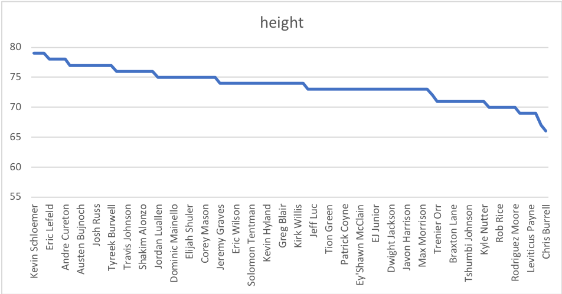
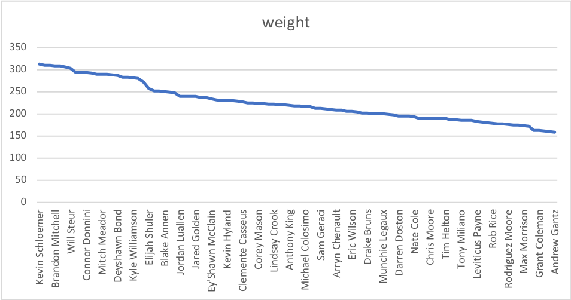
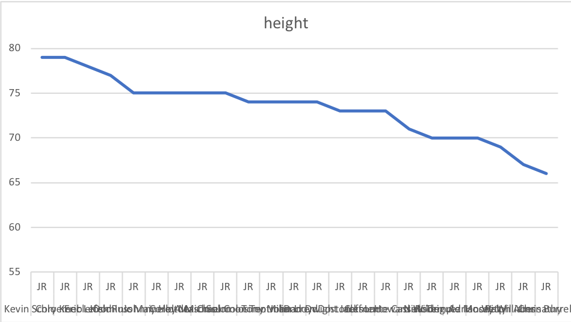
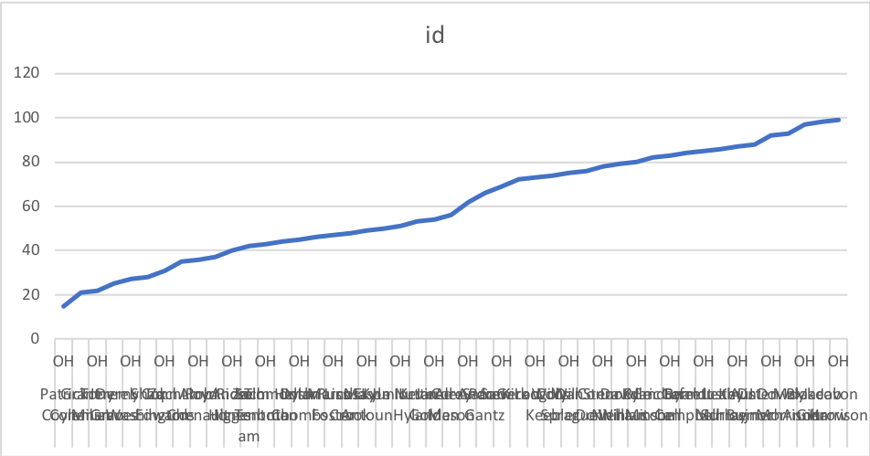
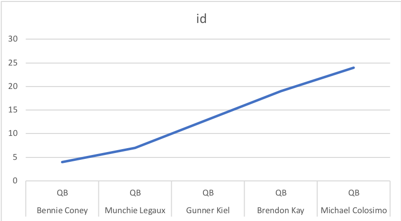

# ICA4

Q1

```sql
SELECT player_name, height
FROM datasets.college_football_players
ORDER BY height DESC
```


Q2

```sql
SELECT player_name, weight
FROM datasets.college_football_players
ORDER BY weight DESC
```


Q3

```sql
SELECT player_name, height
FROM datasets.college_football_players
WHERE year = 'JR'
ORDER BY height DESC
```


Q4

```sql
SELECT player_name, state, id
FROM datasets.college_football_players
WHERE state = 'OR'
ORDER BY id ASC
```


Q5

```sql
SELECT player_name, position, id
FROM datasets.college_football_players
WHERE position = 'QB'
ORDER BY id ASC
```



